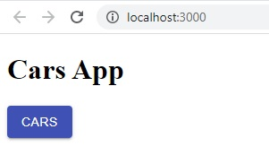
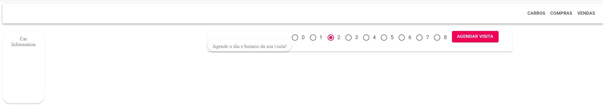
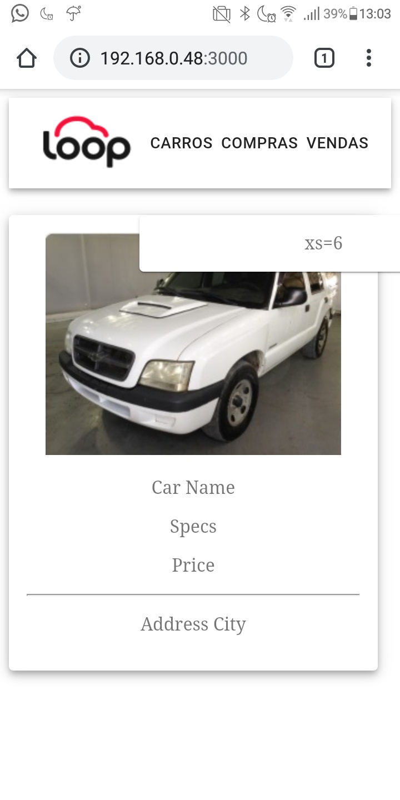

# visit-scheduler

As a test I`m developing a webpage and an API that will interact to schedule visits for our customers. It will consist of a Homepage with a single option to process a schedule request, registering it on our database.

Steps:

[X] Create Repository

[X] Use GitFlow branching model

~~[X] Database - Cars Table~~

~~[ ] Database - Availability Table~~

~~[ ] CRUD~~

[ ] Create/Map API Endpoints

[X] Basic React-Redux APP

[X] Add First MaterialUI Component

[ ] Customize Page

[ ] ADD Api requests

[ ] Final Tests


# Development Journal

In the first day of development, I started by chosing the gitflow branching model.

To build the PHP RESTful Api I`ve chosen the Zend Framework. So first of all I installed PHP 7.4.8 from: https://www.php.net/downloads

Then to build a project skeleton with zend I had to insall composer.phar, wich can be downloaded from https://getcomposer.org/download/ 

As an option you can also run the commands below to download it, and set up the minimal skeleton project:

```
php -r "readfile('https://getcomposer.org/installer');" | php


php composer.phar create-project --repository-url="https://packages.zendframework.com" zendframework/skeleton-application visit-scheduler/car-scheduler-api

```

After setting up zf skeleton I`ve started writing our API configs and routes, with the information on zf website and some articles I could build the 'car-scheduler-api\module\CarScheduler' folder wich in a nutshell contains the custom routes, functions and configs extending zf standards.

The first Route built at 'car-scheduler-api\module\CarScheduler\config\module.config.php':

```
    //First Route Attempt
    'router' => array(
        'routes' => array(
            'cars' => array(
                'type'    => 'segment',
                'options' => array(
                    'route'    => '/cars[/][:action][/:id]',
                    'constraints' => array(
                        'action' => '[a-zA-Z][a-zA-Z0-9_-]*',
                        'id'     => '[0-9]+',
                    ),
                    'defaults' => array(
                        'controller' => 'CarScheduler\Controller\CarScheduler',
                        'action'     => 'index',
                    ),
                ),
            ),
        ),
    ),
```

Even though this route already identifies actions on the Controller using actions "add, get, edit, delete" I`ll be confirming if this can attend the standard "GET, POST, PUT, PATCH, DELETE" methods that I'm used to.

The carsscheduler.db also in the car-scheduler-api\module\CarScheduler folder, was built using SQL syntax and is ready for the first tests:
```
CREATE TABLE cars (
    id    INT (11)      NOT NULL,
    name  VARCHAR (100) NOT NULL,
    specs VARCHAR (100) NOT NULL,
    price DOUBLE        NOT NULL,
    PRIMARY KEY (
        id
    )
);
```

---

13/07/2020

Today I had to rework the API module, and after that I decided to start the front-end part of our application. So I had to come up with a structure using React + Redux + MaterialUI Components. After some testing I came up with a structure that I can now work on the design.

Running npm start on our ~~visits-app~~ now we get this first view:



Now Ill be focusing on the front-end part, so I can design the ZF2 Api with exactly what I need for the front-end.

=======

14/07/2020

Reworking the structure of the app, found out some bugs and better strategies. Before implementing the PHP Backend, I`ll finish the front end part, changing containers and its content to replicate the test example, so far:



Note: Pure html/css/js does not help a lot with this stack, after many attempts I understood the "theme" functionalities from MaterialUI and things are evolving. So far I've spent 8 hours in this test.gi

=======

15/07/2020

Today I've progressed a lot in the layout using MaterialUI components and themes. Current state:


Finally I have the final structure and all I have to work on are the custom scripts for the front-end, and start implementing reducers and php-backend to communicate with the single api endpoint I've created, it's been a real challenge and it forced myself to learn a lot in 4 days. Tomorrow I'll finish adjustments on this page and will try to fix responsiveness on mobile devices, since my containers are not containing its elements:

