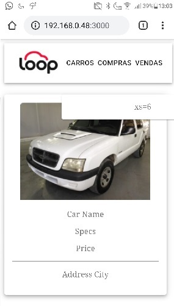

# visit-scheduler

As a project I'm developing a webpage and an API that will interact with each other in order to schedule visits for customers. It will consist of a Homepage with a single option to process a schedule request, recording it on the database.

Steps:

[X] Create Repository

[X] Use GitFlow branching model

~~[X] Database - Cars Table~~

~~[ ] Database - Availability Table~~

~~[ ] CRUD~~

[ ] Create/Map API Endpoints

[X] Basic React-Redux APP

[X] Add First MaterialUI Component

[ ] Customize Page

[ ] ADD Api requests

[ ] Final Tests


# Development Journal

On the first day of development, I started by chosing the gitflow branching model.


To build the PHP RESTful Api I`ve chosen the Zend Framework. So first of all I installed PHP 7.4.8 from: https://www.php.net/downloads

For the structure of the project with zend I  had to install composer.phar, which can be downloaded from:
https://getcomposer.org/download/ 

As an alternative you can also run the commands below to download it, and set up the project structure:

```php
php -r "readfile('https://getcomposer.org/installer');" | php


php composer.phar create-project --repository-url="https://packages.zendframework.com" zendframework/skeleton-application visit-scheduler/car-scheduler-api

```

After setting up zf skeleton I`ve started writing our API configs and routes, with the information on zf website and some articles I could build the 'car-scheduler-api\module\CarScheduler' folder which the custom routes, functions and configs extending zf standards.

The first Route built at 'car-scheduler-api\module\CarScheduler\config\module.config.php':

```php
    //First Route Attempt
    'router' => array(
        'routes' => array(
            'cars' => array(
                'type'    => 'segment',
                'options' => array(
                    'route'    => '/cars[/][:action][/:id]',
                    'constraints' => array(
                        'action' => '[a-zA-Z][a-zA-Z0-9_-]*',
                        'id'     => '[0-9]+',
                    ),
                    'defaults' => array(
                        'controller' => 'CarScheduler\Controller\CarScheduler',
                        'action'     => 'index',
                    ),
                ),
            ),
        ),
    ),
```

Even though this route already identifies actions on the Controller using actions "add, get, edit, delete" I'll be confirming if this can cater to the standard "GET, POST, PUT, PATCH, DELETE" methods that I'm used to.

The carsscheduler.db also in the car-scheduler-api\module\CarScheduler folder, was built using SQL syntax and is ready for the first tests:
```sql
CREATE TABLE cars (
    id    INT (11)      NOT NULL,
    name  VARCHAR (100) NOT NULL,
    specs VARCHAR (100) NOT NULL,
    price DOUBLE        NOT NULL,
    PRIMARY KEY (
        id
    )
);
```

---

13/07/2020

Today I had to rework the API module, and after that I decided to start the front-end part of our application. So I had to come up with a structure using React + Redux + MaterialUI Components. After some testing I came up with a structure that I can now work on the design.

Running npm start on our ~~visits-app~~ now we get this first view:


Now I'll be focusing on the front-end part, so I can design the ZF2 Api with exactly what I need for the front-end.

=======

14/07/2020

Reworking the structure of the app, I found out some bugs and better strategies. Before implementing the PHP Backend, I'll finish the front end part, changing containers and its content to replicate the test example, so far:


Note: Pure html/css/js does not help a lot with this stack, after many attempts I understood the "theme" functionalities from MaterialUI and things are evolving. So far I've spent 8 hours in this test.gi

=======

15/07/2020

Today I've progressed a lot in the layout using MaterialUI components and themes. Current state:


Finally I have the final structure and all I have to work on are the custom scripts for the front-end, and start implementing reducers and php-backend to communicate with the single api endpoint I've created, it's been a real challenge and it forced myself to learn a lot in 4 days. Tomorrow I'll finish adjustments on this page and will try to fix responsiveness on mobile devices, since my containers are not containing its elements:



======

16/07/2020

Progressing to implement the backend part of the application, todays work was all about customizing our front-end to render components based on our back-end data. Post refactoring these lines of codes will receive Available dates and timestamps to be options for the user:

```javascript
    <div>
        {days.map(function (day, index) {
            return(<Button variant="contained" className={classes.customButtonWeek} key={index}>{day}</Button>);
        })}
        </div>
        <div>
            {timeschedules.map(function (time, index) {
            return(<Button variant="contained" className={classes.customButtonWeek} key={index}>{time}</Button>);
        })}
    </div>
<Button variant="contained" className={classes.customButtonSchedule} disableElevation onClick={() => {props.removeComponents()}}>Agendar Visita</Button>
```

With that I can now move to input the backend data using php as requested. The data will contain car information, dates and timestamps availables for schedule. with the backend done I'll be adjusting the application with five different renders:

- Choose a car
- Choose date/timestamp
- Press Schedule Button
- Confirm Schedule Info
- Schedule Success

======

20/07/2020

Started by reviewing the whole repository, adding states and design the flow of the user experience from selecting a car to confirming the schedule

Now we have 3 steps so far, the components render as the states changes when buttons are clicked.:


```javascript
changeComponents = (nextRender) => {
    this.setState(
      {
        page: nextRender
      }
    )
  } 
```

With this now I can set the components that will be rendered according to a page variable. This is the first way I implemented this change of renders, I'm studying other solutions to avoid boilerplate code and overengineering simple components, as React offers a lot of built in functions to Component that I'm not quite aware of.

======

21/07/2020

To start implementing the php backend I did some polishing in the api and set some static data to test the import of those inside the react app, the test result on postman:


The challenge today was all about returning a Json with zend, after some research I had to implement a function inside the application Module so that it would prioritize "JsonStrategy" over the pre-configured views.

```php
    public function registerJsonStrategy(MvcEvent $e)
{
    $app          = $e->getTarget();
    $locator      = $app->getServiceManager();
    $view         = $locator->get('Zend\View\View');
    $jsonStrategy = $locator->get('ViewJsonStrategy');

    $jsonStrategy->attach($view->getEventManager(), 100);
}
```

now I can request this data inside react and render my components using this information.
